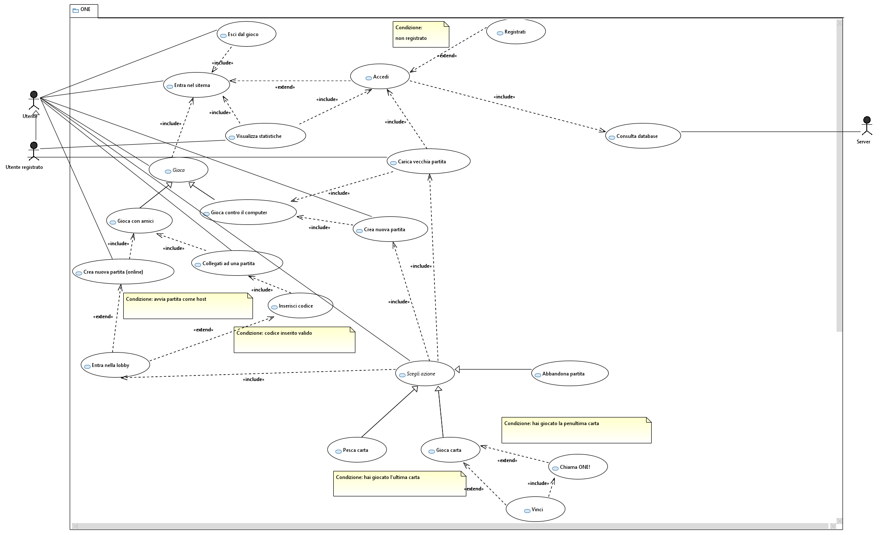

# Specifica dei Requisiti

---

## 1. Introduzione

Il presente documento descrive in modo esaustivo e strutturato i requisiti funzionali e non funzionali del videogioco di carte “UNO-like” basato su Java. Include dettagli sulle interfacce front-end, sulla logica di gioco, sulle componenti server, sul database e sui vincoli tecnologici, fornendo così una base condivisa per sviluppo, test e validazione.

---

## 2. Scopo

Definire tutti i requisiti utili a garantire:
- Coerenza tra esigenze dell’utente e funzionalità implementate  
- Tracciabilità delle funzionalità durante le fasi di sviluppo e collaudo  
- Chiarezza sui vincoli tecnologici e sulle dipendenze esterne  

---

## 3. Ambito

Questo SRS copre:
- Applicativo desktop Java avviabile da file .jar  
- Modalità di gioco: multiplayer client-server, vs bot, tutorial/regolamento
- Autenticazione utenti e gestione statistica  
- Persistenza delle partite incomplete e dello storico  

Non comprende aspetti di marketing, distribuzione in store o versioni mobile.

---

## 4. Stakeholder

- **Giocatori registrati**: usufruiscono di statistiche, salvataggio partite.  
- **Giocatori anonimi**: accedono solo alle modalità senza salvataggio di statistiche.  
- **Amministratori di sistema**: gestiscono server e database. 
- **Sviluppatori**: implementano, mantengono e testano il software.  

---

## 5. Glossario

- **Home**: schermata principale dopo accesso.  
- **Lobby**: stanza virtuale per partite client-server, accessibile tramite codice.  
- **Bot**: avversario controllato dal computer.  
- **ONE!**: pulsante temporaneo per segnalare penultima carta.  
- **MVC**: modello architetturale Model-View-Controller.  

---

## 6. Requisiti Funzionali

### 6.1 Front-End (prima del gioco)

1. RF1 – Avvio  
   - Il gioco deve partire da un eseguibile `.jar`.  

2. RF2 – Schermata di accesso  
   - Opzione Login/Registrazione con checkbox “Resta collegato”.  
   - Opzione Gioca senza login.  

3. RF3 – Statistiche  
   - Utente registrato visualizza partite vinte e giocate.  
   - Utente anonimo non visualizza statistiche.  

4. RF4 – Home post-accesso  
   - Menu con:  
     - Partita con amici (client-server)  
     - Partita contro bot  
     - Tutorial o Regolamento  
     - Esci dal gioco  

5. RF5 – Modalità client-server  
   - RF5.1 – Crea nuova lobby con codice numerico autogenerato.  
   - RF5.2 – Collegati a lobby esistente inserendo codice.  

6. RF6 – Modalità vs bot  
   - RF6.1 – Carica partita incompleta (registrati).  
   - RF6.2 – Crea nuova partita scegliendo numero di bot.  

7. RF7 – Navigazione  
   - Pulsanti per muoversi tra schermate e icona “Home”.  

8. RF8 – Logout/Login da Home  
   - Se utente loggato: pulsante “Logout”.  
   - Se anonimo: pulsante “Login”.  

### 6.2 Front-End (durante il gioco)

1. RF9 – Notifica di turno  
   - Testo in alto: “‹Nome_giocatore›, è il tuo turno:”.  

2. RF10 – Visualizzazioni  
   - Mano del giocatore.
   - Numero di carte degli altri giocatori  
   - Carta sul banco.
   - Indicatore dell’ordine dei turni (stile orologio o “Prossimo: ‹Nome›”).  

3. RF11 – Azioni di gioco  
   - RF11.1 – Pescare carta.  
   - RF11.2 – Selezionare carta in mano e tentare di giocarla. 
   - RF11.3 - Passare il turno.
   - RF11.4 – Messaggio di errore in caso di incompatibilità colore/numero.  

4. RF12 – Pescaggio  
   - Viene pescato una sola carta.  
   - All’arrivo carta “buona”:  
     - Metti sul banco.
     - Oppure tienila in mano e passa il turno.  

5. RF13 – ONE!  
   - Alla penultima carta, mostra finestra (2–3 s) con pulsante “ONE!”.  
   - Se non premuto, vengono pescate 2 carte.  

6. RF14 – Carte speciali  
   - Per +4 o cambio colore: visualizza finestra di selezione colore.  
   - Applicazione effetti (+2, salta turno, inverti) con notifica generica.  

7. RF15 – Cambio turno  
   - Passaggio a giocatore successivo e stato wait.  
   - Notifica: “È il turno di ‹Nome› – carte in mano: ‹n›”.  

8. RF16 – Esito partita  
   - Quando mano=0, mostra schermo vincitore; sui perdenti, nome del vincitore.  

9. RF17 – Fine partita  
   - Pulsanti:  
     - “Home” → schermata iniziale  
     - “Rivincita” → nuova partita (stessi amici o stesso numero di bot)  

10. RF18 – Abbandona partita  
    - Pulsante “Abbandona” con dialog di conferma.  
    - Conferma → ritorno a Home; Annulla → riprendi gioco.  

### 6.3 Back-End (generici)

1. RF19 – Linguaggio e strumenti  
   - Java 11+, Eclipse + Maven.  
   - Papyrus per UML e generazione di codice.  
   - Log4j per logging.  
   - JavaFX per GUI.  
   - Pattern MVC.  
   - PostgreSQL per persistenza.  

### 6.4 Server

1. RF20 – Availability  
   - Server sempre attivo, indipendente dagli utenti online.  

2. RF21 – Multithreading  
   - Pool di thread per gestire richieste multiplayer.  

3. RF22 – Autenticazione e salvataggio  
   - Connessione al DB per login, registrazione e statistiche.  

4. RF23 – Creazione lobby  
   - Endpoint per creare lobby con codice; notifiche di join.  

5. RF24 – Gestione partita 
   - La partita viene gestita dal server con cui i client comunicano.

6. RF25 – Chiusura partita  
   - Endpoint per aggiornare statistiche e rimuovere lobby.  

### 6.5 Database

| Tabella               | Campo                | Tipo          | Note                                       |
|-----------------------|----------------------|---------------|--------------------------------------------|
| UTENTE                | id                   | SERIAL PK     | Auto-increment                             |
|                       | nickname             | VARCHAR(50)   | Unico, non nullo                           |
|                       | password_hash        | VARCHAR(256)  | Hash bcrypt/scrypt                         |
|                       | vittorie             | INT ≥ 0       |                                            |
| PARTITA_INCOMPLETA    | id                   | SERIAL PK     |                                            |
|                       | idUtente             | INT FK        | References UTENTE(id) ON DELETE CASCADE    |
|                       | dettagli             | JSONB         | Stato esatto della partita vs bot          |

- Il DB non memorizza partite multiplayer.  
- Aggiornamento statistiche a ogni fine partita o abbandono.  
- Supporto cancellazione account con cascade dei record.  

---

## 7. Requisiti Non Funzionali

- **Qualità**:
  - Conformità allo standard ISO 9126
  - Supporto sviluppo mediante Stan4j e SonarLint

- **Performance**:  
  - Tempo di avvio ≤ 5 s  
  - Round-trip client-server ≤ 200 ms  

- **Portabilità**:  
  - Windows 10+, macOS 10.13+, Linux  

- **Usabilità**:  
  - Interfaccia intuitiva, apprendimento ≤ 5 min  
  - Supporto completo da tastiera  

- **Sicurezza**:  
  - HTTPS per comunicazioni server  
  - Hashing password   

- **Manutenibilità**:  
  - Architettura modulare MVC  
  - Documentazione UML aggiornata   

---

## 8. Use Case Principali (incompleto)

| UC ID | Nome                                    | Attori             | Descrizione sintetica                                          |
|-------|-----------------------------------------|--------------------|----------------------------------------------------------------|
| UC1   | Accesso al sistema                      | Utente             | Login/registrazione o gioco anonimo                            |
| UC2   | Visualizza statistiche                  | Utente registrato  | Consultazione storico e vittorie                               |
| UC3   | Crea/Entra in lobby                     | Utente             | Partita con amici tramite codice                              |
| UC4   | Avvia partita vs bot                    | Utente             | Seleziona numero di bot o riprendi partita incompleta         |
| UC5   | Svolgi turno                            | Utente             | Pescaggio, giocata, notifiche e gestione carte speciali       |
| UC6   | Segnala “ONE!”                          | Utente             | Premere pulsante entro 2–3 s alla penultima carta             |
| UC7   | Termina partita                        | Utente             | Messaggio di vittoria/perdita e opzioni Home o Rivincita      |
| UC8   | Abbandona partita                       | Utente             | Dialog di conferma e ritorno a Home                            |
