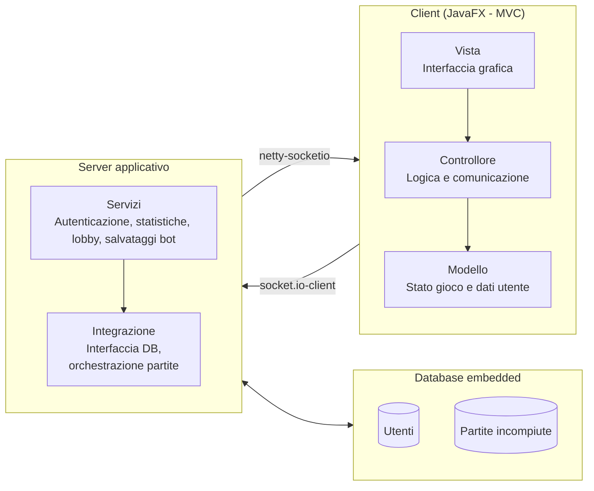
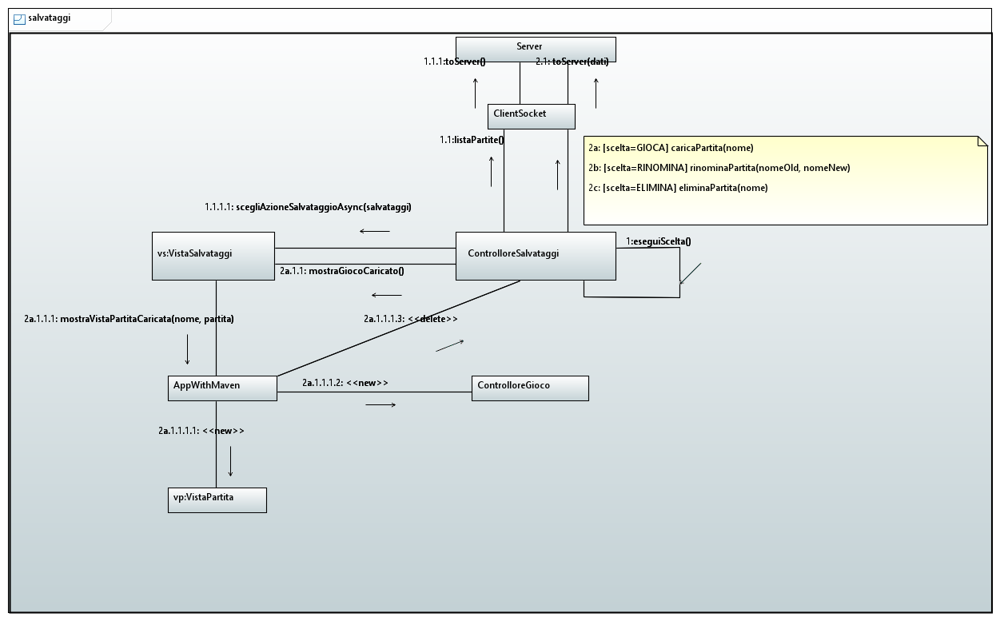
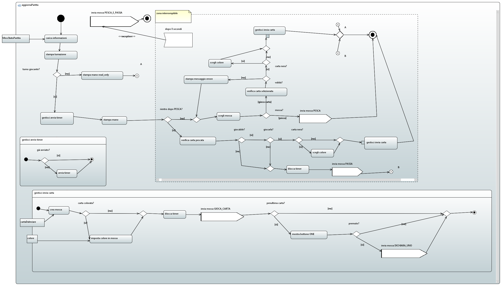

# Design

---

## Introduzione
Questo documento descrive l’architettura e il design dell’applicazione, con focus sui componenti principali, i flussi di processo e il protocollo di comunicazione.

---

## Architettura generale
Applicazione client–server con client desktop JavaFX (pattern MVC) e server centralizzato per servizi di gioco e persistenza.
- Client (JavaFX, MVC):
    - Modello: stato del gioco e dati utente.
    - Vista: interfaccia grafica e rendering dello stato.
    - Controllore: coordinamento interazioni, logica e comunicazione.

- Server applicativo:
    - Servizi: autenticazione, statistiche, lobby, salvataggi bot.
    - Integrazione: interfaccia verso database, orchestrazione partite.

- Database embedded (relazionale):
    - Persistenza: utenti, statistiche, salvataggi di partite incompiute.

- Comunicazione:
    - Client→Server: socket.io-client.
    - Server→Client: netty-socketio.

- Principi architetturali:
    - Separazione: presentazione, logica di dominio, persistenza.
    - Modularità: indipendenza dei componenti per manutenzione e testing.

### Diagramma delle componenti (semplificato)

---

## Viste architetturali
Secondo alcuni punti di vista architetturali:

### <u>Vista logica</u>
Suddivisione in macro‑blocchi e responsabilità, con focus su coesione interna e interfacce pulite tra moduli
- Client GUI (MVC).
- Motore di gioco (regole, turni, validazioni).
- Server (servizi remoti, gestione lobby, persistenza).
- Database (tabelle principali e relazioni).

#### Diagramma delle classi (incompleto)

#### Macchina degli stati finiti (sistema)

### <u>Vista di processo</u>
Principali flussi e interazioni concorrenti, inclusi eventi asincroni e cicli di vita delle partite

- Multiplayer:
    - Ciclo vita: creazione lobby → avvio → scambio mosse → conclusione.
    - Sincronizzazione: ordine turni, eventi ONE!, aggiornamenti stato.

- Partita contro bot:
    - Gestione: logica locale, salvataggi locali/remoti, ripresa partite.
    - Persistenza: salvataggi incompiuti e ripristino.

- Eventi asincroni:
    - Notifiche: turno, carte giocate/pescate, mossa non valida.

#### Diagrammi di sequenza (accesso lato client)

#### Diagramma di comunicazione (gestione salvataggi lato client)

#### Diagramma di attività (gestione partita online lato client)

---

## Protocollo di comunicazione
API di alto livello per autenticazione, gestione stanze, azioni di gioco, disconnessione e statistiche.

### Autenticazione

| Messaggio              | Direzione       | Descrizione                                | Payload              |
|------------------------|-----------------|--------------------------------------------|----------------------|
| RichiestaRegistrazione | Client→Server   | Il client invia le credenziali per registrarsi. | username; password   |
| RispostaRegistrazione  | Server→Client   | Il server risponde con l’esito della registrazione. | esito; messaggio     |
| RichiestaAccesso       | Client→Server   | Il client invia le credenziali per accedere.   | username; password   |
| RispostaAccesso        | Server→Client   | Il server risponde con l’esito dell’accesso.  | esito; messaggio     |

---

### Gestione stanze e partite

| Messaggio            | Direzione       | Descrizione                                           | Payload                         |
|----------------------|-----------------|-------------------------------------------------------|---------------------------------|
| RichiestaNuovaPartita| Client→Server   | Il client richiede la creazione di una nuova partita. | nomePartita; impostazioni       |
| NotificaNuovaPartita | Server→Client   | Il server conferma la creazione di una nuova partita.| idPartita; giocatori            |
| RichiestaUniscitiPartita | Client→Server | Il client richiede di unirsi a una partita esistente. | idPartita                       |
| NotificaInizioPartita  | Server→Client  | Il server notifica l’inizio della partita.           | idPartita; ordineTurni; manoIniziale |

---

### Azioni di gioco

| Messaggio             | Direzione       | Descrizione                                          | Payload                       |
|-----------------------|-----------------|------------------------------------------------------|-------------------------------|
| GiocaCarta            | Client→Server   | Il client gioca una carta nella partita.             | idPartita; carta              |
| NotificaCartaGiocata  | Server→Client   | Il server notifica la carta giocata da un giocatore. | idPartita; giocatore; carta   |
| PescaCarta            | Client→Server   | Il client pesca una carta dal mazzo.                 | idPartita                     |
| NotificaCartaPescata  | Server→Client   | Il server notifica la carta pescata.                 | idPartita; carta              |
| NotificaMossaNonValida| Server→Client   | Il server notifica che la mossa non è valida.       | idPartita; motivo             |
| AggiornamentoTurno    | Server→Client   | Il server aggiorna il turno corrente.               | idPartita; giocatoreCorrente  |

---

### Disconnessione e abbandono

| Messaggio             | Direzione       | Descrizione                                         | Payload      |
|-----------------------|-----------------|-----------------------------------------------------|--------------|
| RichiestaDisconnessione | Client→Server | Il client richiede di disconnettersi da una partita.| idPartita    |
| AbbandonaPartita      | Client→Server   | Il client abbandona la partita.                     | idPartita    |
| NotificaAbbandono     | Server→Client   | Il server notifica che un giocatore ha abbandonato.| idPartita; giocatore |

---

### Elenchi e statistiche

| Messaggio                 | Direzione       | Descrizione                                          | Payload                                |
|---------------------------|-----------------|------------------------------------------------------|----------------------------------------|
| RichiestaPartiteInCorso   | Client→Server   | Il client richiede la lista delle partite in corso.  | nessuno                                |
| ListaPartiteInCorso       | Server→Client   | Il server invia la lista delle partite attive.       | partite (id; nome; giocatoriConnessi)  |
| RichiestaStatistiche      | Client→Server   | Il client richiede le proprie statistiche di gioco.  | nessuno                                |
| Statistiche               | Server→Client   | Il server invia le statistiche del giocatore.        | vittorie; sconfitte; partiteGiocate    |

---

#### Fine partita e decisioni successive

| Messaggio                         | Direzione       | Descrizione                                                                   | Payload                                   |
|-----------------------------------|-----------------|-------------------------------------------------------------------------------|-------------------------------------------|
| NotificaFinePartita               | Server→Client   | Il server notifica la fine della partita e la classifica finale.             | idPartita; classifica                     |
| RichiestaDecisioneProssimaPartita | Server→Client   | Il server chiede se i giocatori vogliono fare un’altra partita.              | idPartita                                 |
| DecisioneProssimaPartita          | Client→Server   | Il client comunica la decisione di giocare ancora o meno.                    | idPartita; giocaAncora (boolean)          |
| RispostaDecisioneProssimaPartita  | Server→Client   | Il server invia le decisioni di tutti i giocatori.                            | idPartita; decisioni (giocatore; scelta)  |

