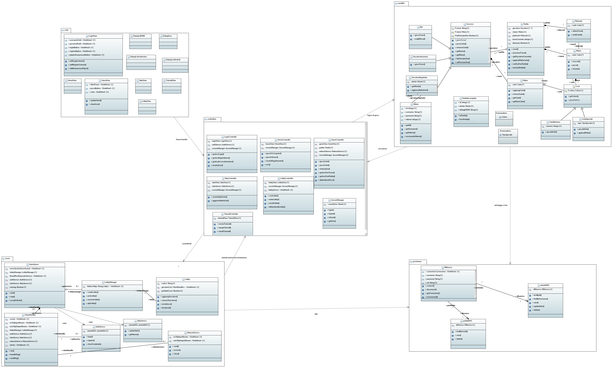

# Design

---

## Architettura generale
L’applicazione si basa su un’architettura client–server.\
Client costituito da un'applicazione desktop Java sviluppata con JavaFX strutturata secondo il pattern MVC, dove:
- Modello gestisce lo stato del gioco e dei dati utente.
- Vista rappresenta l’interfaccia grafica e visualizza lo stato.
- Controllore coordina interazioni, logica e comunicazione.
- Server applicativo: gestisce autenticazione, statistiche, creazione e gestione delle lobby, salvataggio partite contro bot, e interfaccia verso il database.
- Database: database relazionale embedded per conservare utenti, statistiche e salvataggi delle partite incompiute.

Comunicazione in rete:
- Comunicazione da client verso server realizzata con la libreria socket.io-client.
- Comunicazione da server verso client realizzata con la libreria netty-socketio.

Pattern architetturale di riferimento:
- Chiarezza di separazione tra presentazione (GUI), logica di gioco (engine) e gestione dati.
- Indipendenza e modularità per facilitare manutenzione e testing.

---

## Views architetturali
Secondo i diversi punti di vista architetturali:

### 1. Vista logica
Mostra la suddivisione in macro‑blocchi:
- Client GUI (MVC).
- Motore di gioco (regole, turni, validazioni).
- Server (servizi remoti, gestione lobby, persistenza).
- Database (tabelle principali e relazioni).
- Evidenzia la separazione tra strato di presentazione, logica di dominio e persistenza.

#### Diagramma delle classi (incompleto)

#### Macchina degli stati finiti (incompleto)

### 2. Vista di processo
Rappresenta i principali flussi e interazioni concorrenti:
- Ciclo di vita di una partita multiplayer (creazione lobby → avvio → scambio mosse → conclusione).
- Partita contro bot e gestione salvataggi locali/remoti.
- Eventi asincroni (notifiche turno, ONE!, aggiornamenti stato).

#### Diagrammi di sequenza (accesso lato client)

### 3. Vista fisica
Mostra la distribuzione sui nodi:
- Postazioni client (Java + JavaFX) sui PC degli utenti.
- Server applicativo centralizzato.
- Database su macchina dedicata o cluster.
- Connessioni sicure client–server e P2P client–client per la fase di gioco.

### 4. Vista dei dati
Illustra le entità principali (utenti, statistiche, partite incompiute) e la loro persistenza.\
Mostra i flussi di aggiornamento (fine partita, abbandono, cancellazione account).

### 5. Vista delle interfacce (alto livello)
Descrive le API server disponibili (login, registrazione, lobby, statistiche, salvataggi).\
Sintetizza il protocollo base usato per scambio mosse e sincronizzazione.
#### Autenticazione

| Messaggio              | Direzione       | Descrizione                                | Payload              |
|------------------------|-----------------|--------------------------------------------|----------------------|
| RichiestaRegistrazione | Client→Server   | Il client invia le credenziali per registrarsi. | username; password   |
| RispostaRegistrazione  | Server→Client   | Il server risponde con l’esito della registrazione. | esito; messaggio     |
| RichiestaAccesso       | Client→Server   | Il client invia le credenziali per accedere.   | username; password   |
| RispostaAccesso        | Server→Client   | Il server risponde con l’esito dell’accesso.  | esito; messaggio     |

---

#### Gestione stanze e partite

| Messaggio            | Direzione       | Descrizione                                           | Payload                         |
|----------------------|-----------------|-------------------------------------------------------|---------------------------------|
| RichiestaNuovaPartita| Client→Server   | Il client richiede la creazione di una nuova partita. | nomePartita; impostazioni       |
| NotificaNuovaPartita | Server→Client   | Il server conferma la creazione di una nuova partita.| idPartita; giocatori            |
| RichiestaUniscitiPartita | Client→Server | Il client richiede di unirsi a una partita esistente. | idPartita                       |
| NotificaInizioPartita  | Server→Client  | Il server notifica l’inizio della partita.           | idPartita; ordineTurni; manoIniziale |

---

#### Azioni di gioco

| Messaggio             | Direzione       | Descrizione                                          | Payload                       |
|-----------------------|-----------------|------------------------------------------------------|-------------------------------|
| GiocaCarta            | Client→Server   | Il client gioca una carta nella partita.             | idPartita; carta              |
| NotificaCartaGiocata  | Server→Client   | Il server notifica la carta giocata da un giocatore. | idPartita; giocatore; carta   |
| PescaCarta            | Client→Server   | Il client pesca una carta dal mazzo.                 | idPartita                     |
| NotificaCartaPescata  | Server→Client   | Il server notifica la carta pescata.                 | idPartita; carta              |
| NotificaMossaNonValida| Server→Client   | Il server notifica che la mossa non è valida.       | idPartita; motivo             |
| AggiornamentoTurno    | Server→Client   | Il server aggiorna il turno corrente.               | idPartita; giocatoreCorrente  |

---

#### Disconnessione e abbandono

| Messaggio             | Direzione       | Descrizione                                         | Payload      |
|-----------------------|-----------------|-----------------------------------------------------|--------------|
| RichiestaDisconnessione | Client→Server | Il client richiede di disconnettersi da una partita.| idPartita    |
| AbbandonaPartita      | Client→Server   | Il client abbandona la partita.                     | idPartita    |
| NotificaAbbandono     | Server→Client   | Il server notifica che un giocatore ha abbandonato.| idPartita; giocatore |

---

#### Elenchi e statistiche

| Messaggio                 | Direzione       | Descrizione                                          | Payload                                |
|---------------------------|-----------------|------------------------------------------------------|----------------------------------------|
| RichiestaPartiteInCorso   | Client→Server   | Il client richiede la lista delle partite in corso.  | nessuno                                |
| ListaPartiteInCorso       | Server→Client   | Il server invia la lista delle partite attive.       | partite (id; nome; giocatoriConnessi)  |
| RichiestaStatistiche      | Client→Server   | Il client richiede le proprie statistiche di gioco.  | nessuno                                |
| Statistiche               | Server→Client   | Il server invia le statistiche del giocatore.        | vittorie; sconfitte; partiteGiocate    |

---

#### Fine partita e decisioni successive

| Messaggio                         | Direzione       | Descrizione                                                                   | Payload                                   |
|-----------------------------------|-----------------|-------------------------------------------------------------------------------|-------------------------------------------|
| NotificaFinePartita               | Server→Client   | Il server notifica la fine della partita e la classifica finale.             | idPartita; classifica                     |
| RichiestaDecisioneProssimaPartita | Server→Client   | Il server chiede se i giocatori vogliono fare un’altra partita.              | idPartita                                 |
| DecisioneProssimaPartita          | Client→Server   | Il client comunica la decisione di giocare ancora o meno.                    | idPartita; giocaAncora (boolean)          |
| RispostaDecisioneProssimaPartita  | Server→Client   | Il server invia le decisioni di tutti i giocatori.                            | idPartita; decisioni (giocatore; scelta)  |

